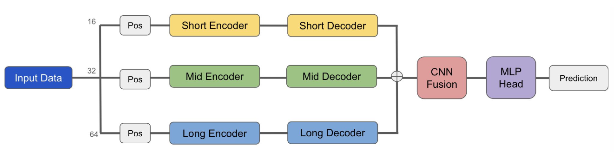
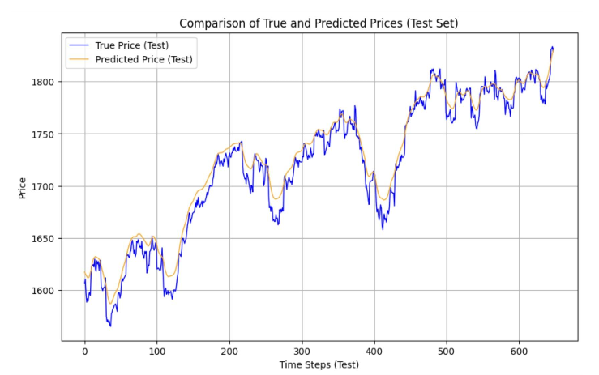
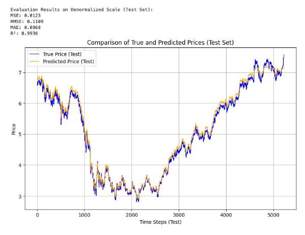
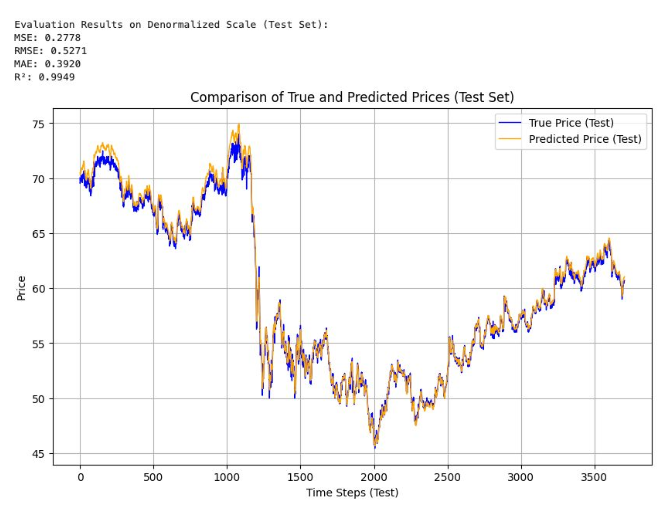
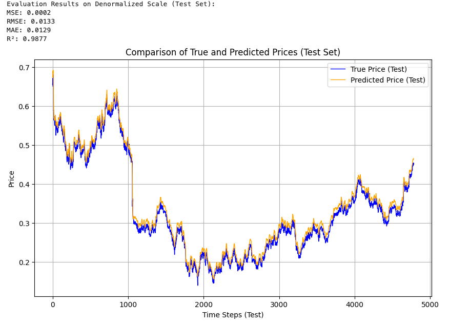
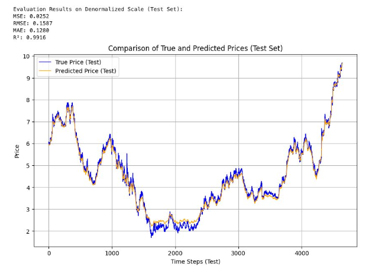
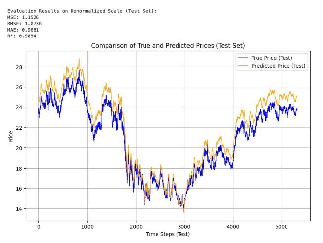
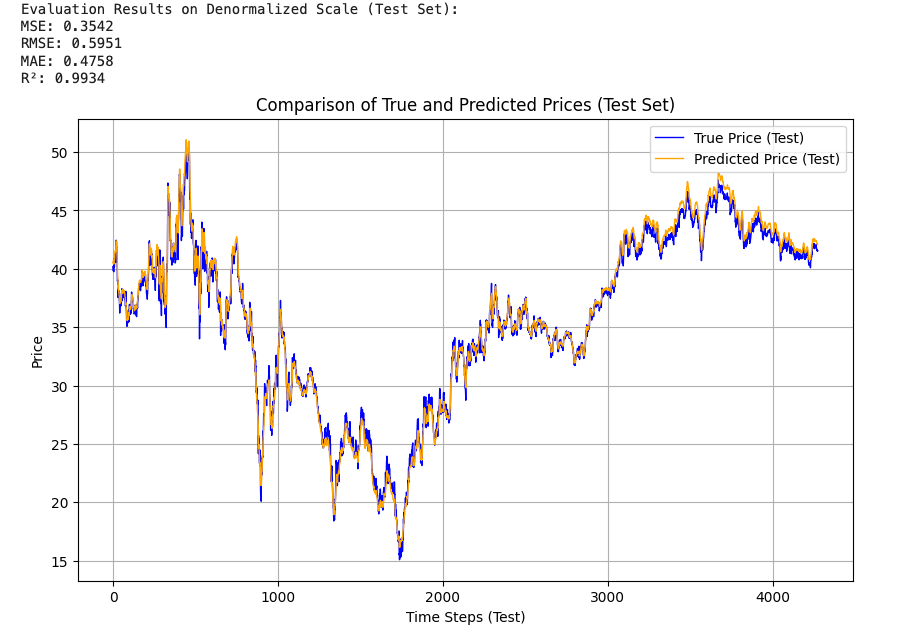

# Multi-Scale Transformer for Stock Price Prediction

## Overview

This project leverages a **multi-scale Transformer-based model** to predict stock prices using historical market data. The model integrates data resampled at multiple temporal resolutions (15-minute, 30-minute, and 60-minute intervals) and processes them using separate encoders and decoders. By capturing short-term, mid-term, and long-term dependencies, the model achieves high predictive accuracy across multiple stocks.

---

## Features

- **Multi-Scale Resampling**:  
  Input data is resampled into 15-minute, 30-minute, and 60-minute intervals to extract patterns at different time scales.

- **Sequence-Based Predictions**:  
  Different sequence lengths (16, 32, and 64 time steps) are defined for each scale, ensuring the model has sufficient historical context.

- **Transformer Architecture**:  
  A multi-branch Transformer model processes resampled sequences independently:
  - Separate encoders and decoders for short-term, mid-term, and long-term data.  
  - A **1D convolutional layer** fuses outputs from all scales into a unified representation for prediction.

- **Robust Performance**:  
  The model achieves strong results on stocks like **PEP**, **CSCO**, **AAPL**, and others, with metrics such as MSE, RMSE, MAE, and $R^2$ validating its accuracy.

---

## Project Workflow

### 1. **Data Processing**
- Historical stock price data (`open`, `high`, `low`, `close`, `volume`) is resampled into:
  - 15-minute intervals (`close_15`, `volume_15`, etc.)
  - 30-minute intervals (`close_30`, `volume_30`, etc.)
  - 60-minute intervals (`close_60`, `volume_60`, etc.)
- Missing values are handled using **forward filling** to maintain temporal consistency.
- Features are normalized using **MinMaxScaler** to map values between [0, 1].

### 2. **Sequence Preparation**
- Sequences are created for each resampled time scale:
  - **Short-term (15-min)**: 16 time steps.
  - **Mid-term (30-min)**: 32 time steps.
  - **Long-term (60-min)**: 64 time steps.
- Target labels are the `close_15` values at the next time step.

### 3. **Model Design**
The Transformer model consists of:
- **Embedding Layer**: Maps input features into high-dimensional space.
- **Positional Encoding**: Adds sinusoidal positional embeddings to account for temporal order.
- **Encoders and Decoders**: Separate branches process the short-, mid-, and long-term sequences.
- **Feature Fusion**: A 1D convolutional layer merges outputs from all scales into a compact representation.
- **MLP Layer**: Predicts the next `close_15` price based on fused features.

This diagram illustrates the multi-scale Transformer model architecture, showcasing the separate encoders and decoders for different time scales and the feature fusion process.

### 4. **Training and Evaluation**
- **Loss Function**: Mean Squared Error (MSE).
- **Optimizer**: Adam optimizer with a learning rate of 1e-4.
- **Metrics**: MSE, RMSE, MAE, and $R^2$ score.
- **Visualization**: Predicted and actual stock prices are plotted to validate the model’s performance.

---

## Result
We trained the test the model performance on NASDAQ index and multiple individual stocks.

We visualized the predicted price with the actual price (inverse-transformed), and evaluated on several metrics.

### Performance Graph for NASDAQ
- Mean Squared Error (MSE): 0.3581
- Root Mean Squared Error (RMSE): 0.5951
- Mean Absolute Error (MAE): 0.6720
- R² Score: 0.9697

Below is a graph comparing the predicted stock prices with the actual stock prices for the NASDAQ index:

### Performance Graph for AAPL

### Performance Graph for PEP

### Performance Graph for NVDA

### Performance Graph for AMD

### Performance Graph for CSCO

### Performance Graph for JPM

## Installation

### Prerequisites
- Python 3.8+
- Libraries:
  - `pandas`
  - `torch` (PyTorch)
  - `sklearn`
  - `matplotlib`
  - `numpy`
